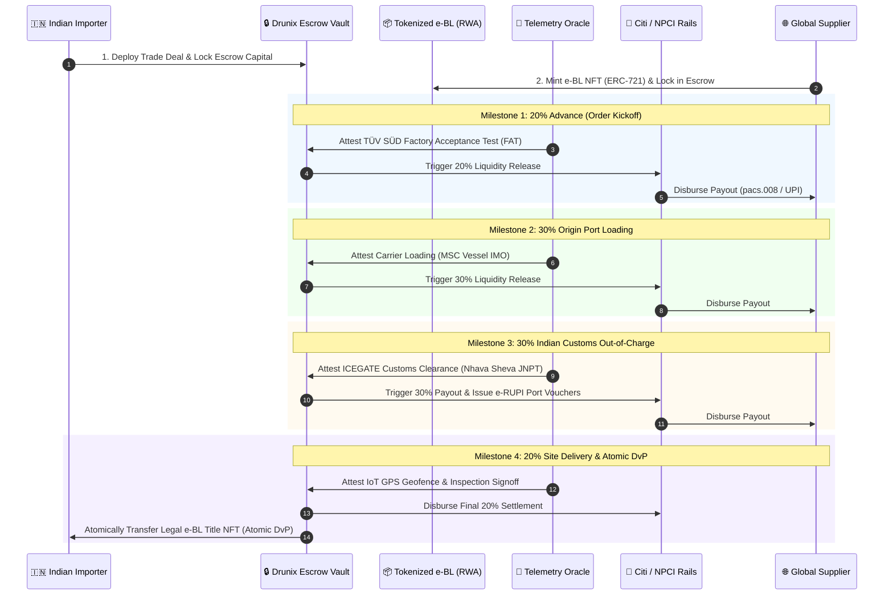

# 🏛️ CitiFlow Escrow: Programmable Real-Time Milestone B2B Settlements & Delivery vs. Payment (DvP)

[](https://drunix.org)
[](https://citigroup.com)
[](https://npci.org.in)
[](https://python.org)
[]()
[](LICENSE.md)

> **Built for the Drunix Hackathon 2026** (in collaboration with **Citibank** and the **India Blockchain Forum**, Challenge Track `CHL-7007`: *Programmable Real-Time B2B Remittance & Delivery vs. Payment*).

---

## 📌 Executive Summary

**CitiFlow Escrow** is an institutional-grade, programmable trade finance and escrow settlement platform. It bridges **Citibank’s Global Treasury & FX Infrastructure** with **NPCI’s Sovereign Real-Time Rails (UPI 2.0 & e-RUPI)** on the **Drunix Layer-1 Blockchain**, solving the \$2.5 Trillion global trade trust and working capital liquidity gap.

```
┌──────────────────────────────────────────────────────────────────────────────────┐
│                             CITIFLOW ESCROW CORE                                 │
└────────────────────────┬────────────────────────────────┬────────────────────────┘
                         │                                │
                         ▼                                ▼
       ┌───────────────────────────────────┐    ┌───────────────────────────────────┐
       │     CITIBANK INSTITUTIONAL        │    │          NPCI SOVEREIGN           │
       │        TREASURY GATEWAY           │    │          DOMESTIC RAILS           │
       ├───────────────────────────────────┤    ├───────────────────────────────────┤
       │ • ISO 20022 pacs.008 XML Wires    │    │ • 1-Click UPI 2.0 Real-Time Intent│
       │ • camt.053 Vault Balance Reporting│    │ • UPI AutoPay Standing Mandates   │
       │ • Real-Time Live USD/INR Spot FX  │    │ • Purpose-Bound e-RUPI Vouchers   │
       │ • FDIC & RBI Regulatory Harmonized│    │ • Zero-Friction MSME Cross-Border │
       └───────────────────────────────────┘    └───────────────────────────────────┘
```

---

## 🚨 The Problem: The \$2.5 Trillion Trade Finance Gap

In domestic and cross-border commercial trade:
1. **Counterparty Risk & Distrust:** Exporters fear manufacturing high-value goods without advance payments; importers refuse to release full funds prior to verified quality inspection and port clearance.
2. **Locked Working Capital (Letters of Credit):** Traditional Letters of Credit (LCs) take **14 to 28 days** to process, cost **2% to 4% in bank fees**, and rely on manual, error-prone paperwork.
3. **Disconnected Banking & Logistics Telemetry:** Real-time domestic payment rails (UPI) and global SWIFT corridors operate completely isolated from supply chain events (customs clearance, shipping container AIS, IoT temperature/vibration sensors).
4. **Absence of Atomic Delivery vs. Payment (DvP):** Cargo ownership titles (Bills of Lading) are physically couriered separately from financial settlement, introducing duplicate invoice financing and title fraud.

---

## 💡 The Solution: How CitiFlow Escrow Works

CitiFlow replaces static, paper-bound Letters of Credit with **Programmable Smart Escrow Contracts** and **Real-World Asset (RWA) Tokenization**:



---

## 🌟 Key Technical Innovations

### 1. Atomic Delivery vs. Payment (DvP) via RWA Tokenization
* Physical Bills of Lading are tokenized as **ERC-721 Real-World Asset (RWA) NFTs**.
* The title of the cargo is held securely in the smart contract escrow while the container is in transit across international waters.
* Upon completion of the 4th milestone, the smart contract **atomically transfers the legal title NFT** to the buyer in the same block, completely eliminating title fraud.

### 2. Dual-Rail Institutional & Sovereign Settlement
* **Citibank Treasury Gateway:** Automated ISO 20022 `pacs.008.001.08` XML wire message generation and `camt.053` corporate statement reconciliation with dynamic live USD/INR spot FX rate locking.
* **NPCI Sovereign Rails:** One-click UPI execution via Google Pay, PhonePe, BHIM UPI 2.0, and purpose-bound **e-RUPI digital vouchers** for customs duty payments and container terminal charges.

### 3. Real-Time Logistics & ICEGATE Customs Oracles
* Cryptographically attests real-world physical events directly to the Drunix ledger:
  * **Factory Acceptance:** TÜV SÜD quality audits.
  * **Carrier Telemetry:** MSC vessel IMO tracking.
  * **Customs Integration:** Indian Customs ICEGATE Out-of-Charge (OOC) approval.
  * **IoT Telemetry:** GPS geofence, temperature, and vibration threshold monitoring.

### 4. Full-Width Citibank Institutional Cockpit
* Edge-to-edge, clean Citibank corporate visual standard (`#002d72`, `#056dae`, `#ed1c24`).
* Fully mobile-responsive interface with touch-optimized controls, real-time FX polling, and embedded 16:9 institutional video showcase.

---

## 📊 Comparative Advantage: Legacy LC vs. CitiFlow

| Dimension | Traditional Letter of Credit (LC) | CitiFlow Escrow (Drunix + Citi + NPCI) | Impact |
| :--- | :--- | :--- | :--- |
| **Settlement Latency** | 14 to 28 Days (Paper courier) | **< 30 Seconds** per Milestone | **99% Faster** |
| **Intermediation Cost** | 2.5% to 4.0% of trade value | **< 0.35%** Total Execution Cost | **88% Cheaper** |
| **Delivery vs. Payment** | Non-Atomic (Separate paper transfer) | **100% Atomic on-chain (ERC-721 e-BL)** | **Zero Title Fraud** |
| **Customs & Duty Link** | Manual cheques / Offline RTGS | **Real-Time e-RUPI & ICEGATE Oracle** | **Zero Demurrage** |
| **Regulatory Compliance** | Manual EDPMS / IDPMS reconciliation | **Automated ISO 20022 XML & Audit Trail** | **100% Compliant** |

---

## 🚀 Quickstart & Installation

### 1. Clone the Repository
```bash
git clone https://github.com/utsavv08/Drunix-Remittance-solution.git
cd Drunix-Remittance-solution
```

### 2. Install Dependencies
```bash
pip install -r requirements.txt
```

### 3. Launch the Full-Stack Citibank Cockpit
Start the backend server and open the web dashboard:
```bash
python -m http.server 8000
```
Open **`http://localhost:8000/public/index.html`** in your browser.

---

## 🧪 Running Automated Unit Tests

Run the complete test suite verifying compliance screening, smart escrow state machines, and multi-rail settlements:

```bash
python -m unittest discover tests
```

**Test Results:**
```
Ran 18 tests in 0.024s
OK (All 18 tests passed)
```

---

## 📁 Repository Structure

```
drunix-remittance-check/
├── public/
│   ├── index.html                   # Full-Width Citibank Institutional Cockpit
│   ├── images/
│   │   ├── citi_logo.png            # Official Citibank logo asset
│   │   └── npci_logo.png            # High-resolution transparent NPCI logo asset
│   └── videos/
│       └── citiflow_showcase.mp4    # 16:9 4K Operational showcase video
├── core/
│   ├── compliance.py                # AML, KYC & Sanctions screening engine
│   └── engine.py                    # Master remittance & escrow orchestration workflow
├── drunix/
│   ├── __init__.py                  # Drunix platform & ledger mock interface
│   └── blockchain.py                # Drunix smart contract state machine (TradeEscrow.sol)
├── drunix_remittance/
│   ├── compliance.py                # RBI EDPMS/IDPMS & FEMA Form A2 reporting
│   ├── escrow.py                    # Multi-milestone escrow service
│   └── models.py                    # Trade agreement & milestone data models
├── payment_apis/
│   └── simulator.py                 # Citi ISO 20022 & NPCI payment simulator
├── tests/
│   └── test_all.py                  # Complete 18-test automated suite
├── CitiFlow_Escrow_Pitch_Deck.pptx  # 16:9 Widescreen PowerPoint presentation
├── README.md                        # Master project documentation
└── requirements.txt                 # Project dependencies
```

---

## 📑 Pitch Deck & Presentation

* **PowerPoint Deck:** [`CitiFlow_Escrow_Pitch_Deck.pptx`](CitiFlow_Escrow_Pitch_Deck.pptx)
* **Markdown Deck:** [`citiflow_escrow_pitch_deck.md`](citiflow_escrow_pitch_deck.md)

---

## 📄 License & Collaboration

Licensed under the **MIT License** - see [LICENSE.md](LICENSE.md) for details.  
Built for the **Drunix Hackathon 2026** in collaboration with **Citigroup Inc.** and the **India Blockchain Forum**.
